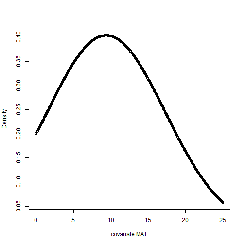
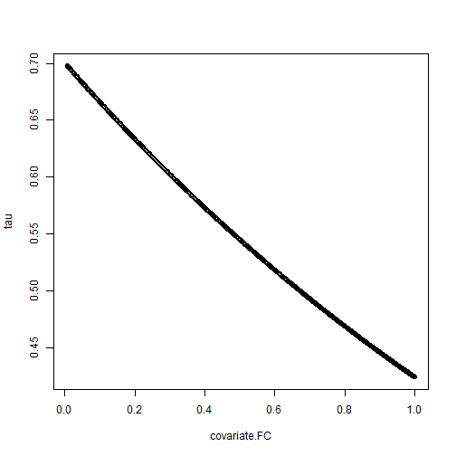
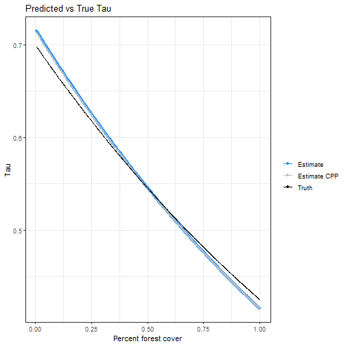
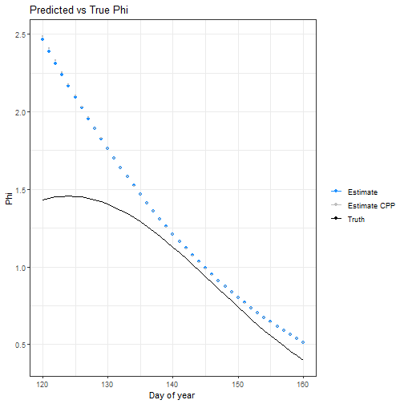
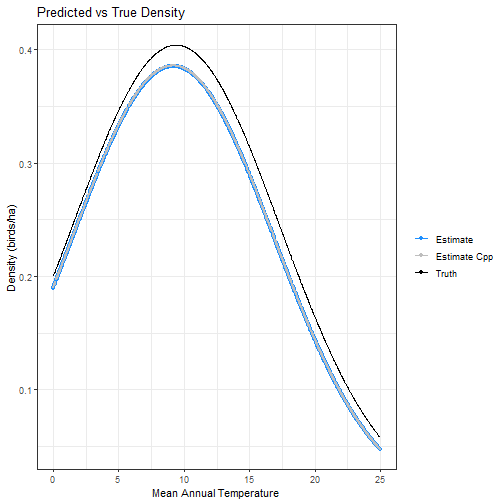

```r
# **************************************
# Simulate 2000 point counts that were collected under 30 different protocols
#
# Survey-level density has a quadratic relationship with a 'mean annual temperature' covariate
#
# Tau is negatively affected by a 'forest cover' covariate
# Phi has a quadratic relationship with a 'day of year' covariate
# **************************************

library(tidyverse)
library(ggpubr)

# rm(list=ls())

set.seed(999)

# setwd("~/1_Work/Bird_Detectability/QPAD") # <- set to wherever scripts are stored
Rcpp::sourceCpp("nll_fun.cpp")
```

```
## 
## > x = matrix(c(2, 2, 0, 0, 0, 0, 0, 0, 0, 0), ncol=1)
## 
## > prob = matrix(c(0.2766035, 0.181491 ,0.128348, 0.09668001, 0.07657428, 0.06303872, 0.05344503,0.04634278, 0.04089231, 0.03658438), nrow=1, ncol = 10 .... [TRUNCATED] 
## 
## > size = 0
## 
## > logdmultinomCPP(x, size, prob)
## [1] -7.369733
```

```r
source("cmulti_fit_joint_cpp.R")
source("joint_fns.R")
```

```r
# Specify density relationship
```

```r
# Number of point counts / survey locations to simulate
nsurvey = 2000 

# Mean annual temperature at each survey
covariate.MAT <- runif(nsurvey,0,25)
Density <- exp(log(0.2) + 0.15*covariate.MAT -0.008*covariate.MAT^2)

plot(Density~covariate.MAT)
```



```r
# Simulate relationship between tau and forest cover
```

```r
covariate.FC <- plogis(rnorm(nsurvey,1,2))
tau_betas <- c(log(0.7),-0.5)

# Tau for each survey
tau <- exp(tau_betas[1] + tau_betas[2]*covariate.FC) 
plot(tau~covariate.FC)
```



```r
# Design matrix for tau
zFC <- scale(covariate.FC)
X1 <- model.matrix(~zFC)
colnames(X1) <- c("tau_int","tau_b1")
```

```r
# Simulate relationship between phi and day-of-year covariate
```

```r
covariate.DOY <- round(runif(nsurvey,120,160))
phi_betas <- c(-15,0.248,-0.001)

# Phi for each survey
phi <- exp(phi_betas[1] + phi_betas[2]*covariate.DOY + phi_betas[3]*covariate.DOY^2) 
plot(phi~covariate.DOY)
```


```r
# Design matrix for phi (scaled covariate for better model convergence)
zDOY <- scale(covariate.DOY)
X2 <- model.matrix(~zDOY + I(zDOY^2))
colnames(X2) <- c("phi_int","phi_b1","phi_b2")
```

```r
# Simulate data collection at each point count
```

```r
# A few different protocols for distance binning
distance_protocols <- list(p1 = c(0.5,1,Inf),
                           p2 = c(0.5,1,2),
                           p3 = c(0.5,1),
                           p4 = c(0.5,Inf),
                           p5 = Inf,
                           p6 = 1)

# A few different protocols for time binning
time_protocols <- list(p1 = c(3,5,10),
                       p2 = 3,
                       p3 = 5,
                       p4 = 10,
                       p5 = seq(1,10,1))

# Maximum number of distance bins
mdbin <- sapply(distance_protocols,function(x) length(x)) %>% max()

# Maximum number of time bins
mtbin <- sapply(time_protocols,function(x) length(x)) %>% max()
```

```r
# Arrays to store point count data
```

```r
Yarray <- array(NA,dim=c(nsurvey,mdbin,mtbin))
rarray <- array(NA,dim=c(nsurvey,mdbin))
tarray <- array(NA,dim=c(nsurvey,mtbin))

for (k in 1:nsurvey){
  
  # Parameters for this survey
  tau_true <- tau[k]
  phi_true <- phi[k]
  Density_true <- Density[k]
  
  # ------------------------------------
  # Place birds on landscape around observer (centred on landscape)
  # ------------------------------------
  dim <- 10 # landscape x and y dimensions (100 metre increments)
  N <- round(Density_true*dim^2) # Number of birds to place on landscape
  
  birds <- data.frame(x = runif(N,-dim/2,dim/2),
                      y = runif(N,-dim/2,dim/2))
  
  # Distances to observer
  birds$dist <- sqrt(birds$x^2 + birds$y^2)
  
  # Remove birds outside maximum distance
  birds <- subset(birds, dist <= (dim/2))
  birds <- birds %>% arrange(dist)
  birds$bird_id = 1:nrow(birds)
  N = nrow(birds)
  
  birds$dist <- birds$dist
  
  # ------------------------------------
  # Simulate bird cues, based on phi_true
  # ------------------------------------
  
  cues <- matrix(NA, nrow=N, ncol = 50)
  for (bird_id in 1:N) cues[bird_id,] <- cumsum(rexp(ncol(cues),phi_true))
  cues <- cues %>% 
    reshape2::melt() %>% 
    rename(bird_id = Var1, cue_number = Var2, time = value) %>%
    arrange(bird_id,cue_number)
  
  cues$dist <- birds$dist[cues$bird_id]
  
  # ------------------------------------
  # Determine which cues are detected, based on tau_true
  # ------------------------------------
  
  cues$p<- exp(-(cues$dist/tau_true)^2)  # Probability each cue is detected
  cues$detected <- rbinom(nrow(cues),1,cues$p) # binary variable: was cue actually detected?
  
  # ------------------------------------
  # Isolate first detected cue for each bird
  # ------------------------------------
  
  dat <- subset(cues,detected == 1)
  dat <- dat[!duplicated(dat$bird_id),]
  
  # ------------------------------------
  # Transcription: distance and time bins
  # ------------------------------------
  
  # Randomly select sampling protocol
  rint <- sample(distance_protocols,1)[[1]]
  tint <- sample(time_protocols,1)[[1]]
  nrint <- length(rint)
  ntint <- length(tint)
  
  # Separate into distance and time bins
  dat$rint <- cut(dat$dist,c(0,rint))
  dat$tint <- cut(dat$time,c(0,tint))
  dat <- na.omit(dat)
  
  Y <- table(dat[,c("rint","tint")])
  
  Y # Data to analyze
  Yarray[k,1:nrint,1:ntint] <- Y
  # print(k)
  
  rarray[k,1:length(rint)] <- rint
  tarray[k,1:length(tint)] <- tint
  
}

# ******************************************
# FIT MODEL TO SIMULATED DATA (only first 1000 point counts)
# ******************************************


Yarray_fit <- Yarray[1:1000,,]
rarray_fit <- rarray[1:1000,]
tarray_fit <- tarray[1:1000,]
X1_fit <- X1[1:1000,]
X2_fit <- X2[1:1000,]

start <- Sys.time()
fit <- cmulti.fit.joint(Yarray_fit,
                        rarray_fit,
                        tarray_fit,
                        X1 = X1_fit, # Design matrix for tau
                        X2 = X2_fit  # Design matrix for phi
)
end <- Sys.time()
print(end-start) # 2.3 min
```

```
## Time difference of 2.075818 mins
```

```r
start <- Sys.time()
fitcpp <- cmulti_fit_joint(Yarray_fit,
                        rarray_fit,
                        tarray_fit,
                        X1 = X1_fit, # Design matrix for tau
                        X2 = X2_fit  # Design matrix for phi
)
end <- Sys.time()
print(end-start) # 2.3 min
```

```
## Time difference of 22.13862 secs
```

```r
# ******************************************
# Extract/inspect estimates
# ******************************************

fit$coefficients
```

```
## [1] -0.68812703 -0.16188680  0.21036108 -0.45150164 -0.02502094
```

```r
fitcpp$coefficients
```

```
## [1] -0.68864508 -0.16138023  0.20757300 -0.45407970 -0.02242051
```

```r
# Estimates of tau
```

```r
tau_est <- exp(X1 %*% fit$coefficients[1:2])
tau_estcpp <- exp(X1 %*% fitcpp$coefficients[1:2])

ggplot()+
  geom_point(aes(x = covariate.FC,y=tau_est, col = "Estimate"))+
  geom_point(aes(x = covariate.FC,y=tau_estcpp, col = "Estimate CPP"),
             alpha = 0.5, size =0.5)+
  geom_line(aes(x = covariate.FC,y=tau, col = "Truth"))+
  xlab("Percent forest cover")+
  ylab("Tau")+
  scale_color_manual(values=c("dodgerblue",'grey', "black"), name = "")+
  ggtitle("Predicted vs True Tau")+
  theme_bw()
```



```r
# Estimates of phi
```

```r
phi_est <- exp(X2 %*% fit$coefficients[3:5])
phi_est_cpp <- exp(X2 %*% fitcpp$coefficients[3:5])

ggplot()+
  geom_point(aes(x = covariate.DOY,y=phi_est, col = "Estimate"))+
  geom_point(aes(x = covariate.DOY,y=phi_est_cpp, col = "Estimate CPP"),
             size = 0.5)+
  geom_line(aes(x = covariate.DOY,y=phi, col = "Truth"))+
  xlab("Day of year")+
  ylab("Phi")+
  scale_color_manual(values=c("dodgerblue","grey","black"), name = "")+
  ggtitle("Predicted vs True Phi")+
  theme_bw()
```



```r
# ******************************************
# Calculate detectability offsets for each survey in the full dataset (n = 2000)
# ******************************************

# Calculate survey-level offsets
log_offsets <- calculate.offsets(fit,
                                   rarray = rarray,
                                   tarray = tarray,
                                   X1 = X1,
                                   X2 = X2)

log_offsetscpp <- calculate.offsets(fitcpp,
                                 rarray = rarray,
                                 tarray = tarray,
                                 X1 = X1,
                                 X2 = X2)

# ******************************************
# Fit density model to point count data, using GLM with effect of mean annual temperature
# ******************************************

dat <- data.frame(Y = apply(Yarray,1,sum,na.rm = TRUE),
                  zMAT = scale(covariate.MAT),
                  log_off = log_offsets,
                  log_offcpp = log_offsetscpp)

glm1 <- glm(Y ~ zMAT + I(zMAT^2) + offset(log_off), family = poisson(link="log"), data = dat)
glm2 <- glm(Y ~ zMAT + I(zMAT^2) + offset(log_offcpp), family = poisson(link="log"), data = dat)

# Predict density at each location
pred_df <- dat
pred_df$log_off <- 0 # Set offset to zero (i.e., remove detectability effects)
pred_df$log_offcpp <- 0 # Set offset to zero (i.e., remove detectability effects)
Dhat <- predict(glm1, newdata = pred_df, type = "response")
Dhatcpp <- predict(glm2, newdata = pred_df, type = "response")

# Estimated density at each survey location (after correcting for detectability)
ggplot()+
  geom_point(aes(x = covariate.MAT,y=Dhat, col = "Estimate"))+
  geom_point(aes(x = covariate.MAT,y=Dhatcpp, col = "Estimate Cpp"),
             size = 0.2)+
  geom_line(aes(x = covariate.MAT,y=Density, col = "Truth"))+
  xlab("Mean Annual Temperature")+
  ylab("Density (birds/ha)")+
  scale_color_manual(values=c("dodgerblue",'grey',"black"), name = "")+
  ggtitle("Predicted vs True Density")+
  theme_bw()
```



